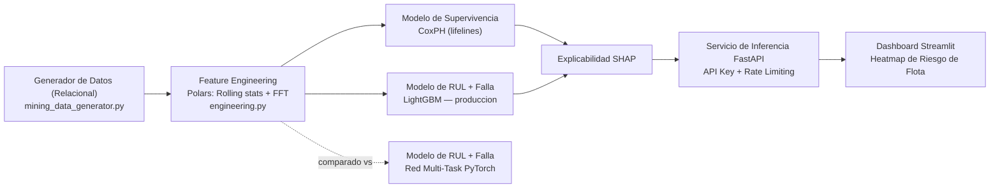

[ 🇬🇧 Read in English ](README.md) | [ 🇨🇱 Español ]

# chile-mining-predictive-maintenance


## Resumen ejecutivo

Sistema hibrido de **Mantenimiento Predictivo** para flotillas de camiones
de extraccion (**CAEX**) y **chancadores primarios** en faenas mineras
chilenas (Chuquicamata, Escondida, Los Bronces, El Teniente, Radomiro
Tomic). Combina **Survival Analysis** (tiempo hasta la falla con datos
censurados), **regresion de Vida Util Restante (RUL)** y **clasificacion
del tipo de falla** — todo explicable con **SHAP** — detras de un servicio
de scoring **FastAPI** autenticado y un dashboard de riesgo de flota en
**Streamlit**.

El pipeline completo corre de punta a punta sobre datos sinteticos pero
estadisticamente realistas, generados por el propio repositorio (fallas
Weibull, curvas de degradacion de sensores, censura por la derecha) — cada
metrica citada en este README proviene de una corrida real de este codigo,
no de una proyeccion.

## 💰 Problema de negocio y ROI

**El problema:** una falla no planificada de un CAEX o un chancador
primario no solo cuesta la reparacion — detiene la cadena de extraccion
completa detras de el. Los planificadores de flota y mantenimiento
necesitan saber, *antes* de que ocurra, que unidades estan cerca de fallar,
por que, y con que urgencia, para poder intervenir de forma **programada**
en vez de **reactiva**.

| Palanca | Mecanismo en este sistema | Metrica de negocio impactada |
|---|---|---|
| Alerta temprana de RUL | Predice horas restantes con ~513h de error sobre un ciclo que llega a ~16.700h — semanas de anticipacion, no alarmas de ultima hora | Horas de parada no planificada |
| Clasificacion de tipo de falla | Indica **que** componente probablemente fallara (rodamiento, hidraulico, termico, estructural, electrico), no solo *cuando* | Tiempo medio de reparacion (MTTR), stock correcto de repuestos |
| Survival analysis (CoxPH) | Ordena el riesgo relativo de toda la flota, incluyendo unidades que aun no han fallado (datos censurados) | Priorizacion de mantenimiento entre cientos de unidades |
| Explicabilidad SHAP | Convierte una prediccion en un diagnostico que un mecanico puede verificar contra las lecturas reales de sensores | Confianza y adopcion por parte de los ingenieros de faena, no una caja negra |

> **Sobre las cifras en dolares:** la parada no planificada de un CAEX o un
> chancador primario es citada ampliamente en la literatura de la industria
> minera como uno de los items de costo por hora mas altos de una
> operacion, ya que la perdida de throughput se propaga por toda la cadena
> de extraccion. Este repositorio **no** calcula un ROI en dolares
> especifico de una faena — el dataset es sintetico — pero el mecanismo de
> arriba (mover fallas de "no planificadas" a "programadas") es la palanca
> estandar que usa el mantenimiento predictivo para capturar ese costo. Un
> despliegue productivo necesitaria cifras reales de costo-por-hora-de-parada
> por faena para cuantificar el ROI con precision.

## 🏗️ Arquitectura del sistema



LightGBM es el modelo de produccion para RUL y clasificacion de falla; la
red multi-task en PyTorch se entreno y evaluo sobre el mismo holdout como
comparacion, no se descarto en silencio — ver
la seccion "Resultados" mas abajo para entender por que gano LightGBM.

## 🛠️ Stack Tecnologico y Profundidad de ML

| Capa | Tecnologia | Rol |
|---|---|---|
| Motor de datos | **Polars + PyArrow** | Procesamiento en memoria de alta velocidad de ~312k filas de telemetria |
| Survival analysis | **Lifelines — Cox Proportional Hazards** | Probabilidad de falla con datos censurados por la derecha (unidades aun operando) |
| Gradient boosting | **LightGBM** | Regresion de RUL + clasificacion multiclase del tipo de falla (produccion) |
| Deep learning | **PyTorch** | Red multi-task de tronco compartido (RUL + clasificacion), entrenada y comparada contra LightGBM |
| Interpretabilidad | **SHAP** (`TreeExplainer`) | Atribucion de features tanto para el regresor de RUL como para el clasificador multiclase |
| API y serving | **FastAPI + slowapi** | Servicio de scoring de riesgo de flota con auth por API key y rate-limiting por IP |
| Dashboard | **Streamlit + Plotly** | Dashboard de telemetria de flota en tiempo real con heatmap de riesgo por equipo |
| Testing | **Pytest + httpx** | 34 tests que cubren integridad de datos, feature engineering, contratos de modelos y auth de la API |

## 📁 Estructura del proyecto

```
chile-mining-predictive-maintenance/
├── data/
│   ├── raw/
│   └── processed/                        # parquet + modelos entrenados (generados)
├── src/
│   ├── data/
│   │   └── mining_data_generator.py      # base relacional sintetica (3 tablas)
│   ├── features/
│   │   └── engineering.py                # rolling stats, deltas, var. acumulada, FFT
│   ├── models/
│   │   ├── train_survival_pipeline.py    # CoxPH + LightGBM (RUL + clasificacion) + SHAP
│   │   ├── multi_task_net.py             # red PyTorch multi-task (RUL + clasificacion), comparada
│   │   └── scoring.py                    # carga de artefactos + scoring compartido
│   ├── api/
│   │   └── main.py                       # FastAPI: score de riesgo (API key + rate limiting)
│   └── app/
│       └── dashboard.py                  # Streamlit: heatmap de riesgo de flota
├── tests/
├── requirements.txt
└── README.md
```

## 🗄️ Esquema relacional sintetico

**`equipment_metadata`** (1 fila por equipo — 520 filas en la corrida por defecto):

| Columna | Tipo | Descripcion |
|---|---|---|
| `equipment_id` | str | Identificador unico (`EQ-0000`, ...) |
| `equipment_type` | str | `CAEX` o `Chancador Primario` |
| `model` | str | Ej. `Caterpillar 797F`, `Metso Superior MKIII` |
| `faena` | str | Chuquicamata, Escondida, Los Bronces, El Teniente, Radomiro Tomic |
| `manufacture_year` | int | Año de fabricacion |
| `install_date` | date | Fecha de instalacion |
| `hours_in_current_cycle` | float | Reloj de supervivencia (`duration`) |
| `event_observed` | bool | `true` = fallo observado, `false` = censurado (aun operando) |

**`sensor_telemetry`** (~312.000 filas en la corrida por defecto):

| Columna | Tipo | Descripcion |
|---|---|---|
| `equipment_id` | str | FK a `equipment_metadata` |
| `timestamp` | datetime | Momento de la lectura |
| `operating_hours` | float | Horas transcurridas del ciclo actual (0 → `hours_in_current_cycle`) |
| `engine_temp_c` | float | Temperatura de motor |
| `vibration_rms_mm_s` | float | Vibracion RMS |
| `hydraulic_pressure_bar` | float | Presion hidraulica |
| `rpm` | float | Revoluciones por minuto |
| `fuel_consumption_lph` | float | Consumo de combustible |

Cubre el **ciclo de vida completo** de cada equipo a resolucion adaptativa:
hora a hora si el ciclo dura menos que
`DEFAULT_TARGET_READINGS_PER_EQUIPMENT = 600` horas, o con intervalo
creciente si es mas largo, para acotar el volumen de datos sin perder
cobertura del ciclo completo.

**`maintenance_logs`** (~1.240 filas en la corrida por defecto):

| Columna | Tipo | Descripcion |
|---|---|---|
| `equipment_id` | str | FK a `equipment_metadata` |
| `event_type` | str | `mantenimiento_programado` o `falla_no_planificada` |
| `component` | str | Componente intervenido |
| `failure_type` | str \| null | Solo si `event_type = falla_no_planificada` |
| `event_timestamp` | datetime | Momento del evento |
| `operating_hours_at_event` | float | Horas del ciclo al momento del evento |
| `downtime_hours` | float | Horas de parada |

El reloj de supervivencia (`hours_in_current_cycle`) modela **horas desde la
ultima gran intervencion**, no horas de vida total del equipo — asi se
simula un proceso de renovacion realista: `duration = min(T, C)`,
`event = 1{T <= C}`, con `T` (tiempo real de falla, Weibull) y `C` (corte de
observacion) generados por equipo segun su tipo, faena y antiguedad.

<details>
<summary>Ejemplo real (<code>equipment_metadata.parquet</code>, primeras filas)</summary>

| equipment_id | equipment_type | model | faena | install_date | hours_in_current_cycle | event_observed |
|---|---|---|---|---|---|---|
| EQ-0000 | CAEX | Liebherr T 284 | Chuquicamata | 2016-04-08 | 9529.25 | false |
| EQ-0001 | CAEX | Liebherr T 284 | Chuquicamata | 2025-02-19 | 3090.60 | true |
| EQ-0002 | CAEX | Caterpillar 797F | Escondida | 2024-10-01 | 2137.36 | false |
| EQ-0003 | CAEX | Komatsu 930E | Radomiro Tomic | 2015-08-19 | 2498.50 | true |
| EQ-0004 | Chancador Primario | ThyssenKrupp TS | Escondida | 2021-06-09 | 8404.09 | false |

</details>

## 🚀 Guia rapida e instalacion

```powershell
git clone https://github.com/Rxyxs/chile-mining-predictive-maintenance.git
cd chile-mining-predictive-maintenance
python -m venv .venv
.venv\Scripts\activate
pip install -r requirements.txt
```

Ejecutar en orden desde la raiz del repositorio:

### 1. Generar la base relacional sintetica

```powershell
python -m src.data.mining_data_generator
```

Genera 520+ equipos, ~312k lecturas de telemetria (ciclo de vida completo) y
su historial de mantenimiento en `data/processed/*.parquet`.

### 2. Feature engineering

```powershell
python -m src.features.engineering
```

Calcula, por equipo (Polars, vectorizado): medias/std rodantes (6h/24h),
deltas de temperatura y presion vs. tendencia de 168h, varianza acumulada
(expanding) de vibracion, y features FFT de vibracion en ventanas
deslizantes de 24 lecturas (amplitud dominante + energia espectral, para
detectar componentes periodicas de defectos de rodamiento).

### 3. Entrenar el pipeline hibrido (LightGBM + CoxPH + SHAP)

```powershell
python -m src.models.train_survival_pipeline
```

Entrena y evalua (siempre con split train/test **a nivel de equipo**, nunca
por fila, para evitar fuga de datos):

- **CoxPH** (supervivencia con censura) → C-Index en holdout.
- **LightGBM Regressor** (RUL, solo equipos con falla observada) → MAE en
  horas.
- **LightGBM Classifier** (tipo de falla mas probable) → Accuracy / F1-macro.
- **SHAP** sobre el modelo de RUL → `data/processed/shap_rul_importance.csv`
  y `data/processed/models/shap_rul_summary.png`.
- **SHAP multiclase** sobre el clasificador de tipo de falla → importancia
  global (`shap_failure_classifier_importance.csv`) y desglosada por clase
  (`shap_failure_classifier_importance_by_class.csv` +
  `data/processed/models/shap_failure_classifier_summary.png`), para que un
  mecanico vea que sensor explica *cada* modo de falla especifico, no solo
  el RUL agregado.

Guarda modelos en `data/processed/models/` y metricas en
`data/processed/metrics.json`.

> El RUL se entrena sobre el ciclo de vida completo de cada equipo fallado
> (no una ventana reciente acotada), por lo que las predicciones van desde
> 0 horas (en la falla) hasta miles de horas en equipos jovenes dentro de
> su ciclo. Los umbrales de riesgo (`src/models/scoring.py`) son horizontes
> de negocio reales: CRITICO < 1 semana, ALTO < 1 mes, MEDIO < 3 meses,
> BAJO en adelante.

### 4. Entrenar la red multi-task (PyTorch) — comparacion

```powershell
python -m src.models.multi_task_net
```

Entrena una `MultiTaskDegradationNet` (tronco compartido + embeddings de
`equipment_type`/`faena` + cabezas de regresion RUL y clasificacion de
falla) sobre el mismo holdout por equipo que el paso anterior, y agrega sus
metricas a `data/processed/metrics.json` bajo la clave
`multi_task_pytorch`, para comparar directamente contra LightGBM (ver
la seccion "Resultados" mas abajo).

### 5. Servicio de scoring (FastAPI)

```powershell
uvicorn src.api.main:app --reload
```

Requiere una API key por header (`X-API-Key`) en todos los endpoints salvo
`/health`, y aplica rate-limiting por IP (60 req/min por defecto):

```powershell
$env:MINING_API_KEY = "tu-clave-secreta"      # default: "dev-key-change-me"
$env:MINING_RATE_LIMIT = "60/minute"          # opcional
uvicorn src.api.main:app --reload
```

```powershell
curl -H "X-API-Key: tu-clave-secreta" http://127.0.0.1:8000/equipment/EQ-0000/risk
```

#### Endpoints de la API

La documentacion interactiva se sirve en `/docs`. **Nota:** estas son las
rutas realmente implementadas en el repositorio — no `/predict/rul` ni
`/fleet/risk-status`, que no existen en el codigo.

| Endpoint | Metodo | Auth | Descripcion |
|---|---|---|---|
| `/health` | GET | No | Estado del servicio, conteo de equipos |
| `/equipment` | GET | Si | Lista de la flota (filtros `faena`, `equipment_type`) |
| `/equipment/{equipment_id}/risk` | GET | Si | RUL predicho, tipo de falla mas probable, probabilidad por clase y supervivencia condicional a 30 dias |
| `/fleet/risk-summary` | GET | Si | Conteo de equipos por nivel de riesgo, global y por faena |
| `/score/raw` | POST | Si | Scoring ad-hoc a partir de un vector de features crudo (sin `equipment_id` registrado) |

### 6. Dashboard de flota (Streamlit)

```powershell
streamlit run src/app/dashboard.py
```

Filtros por faena/tipo/riesgo, KPIs de flota, **heatmap de riesgo por
equipo** (una celda = un equipo, coloreado por nivel de riesgo), tabla
filtrable y panel de detalle por equipo (probabilidades de falla + tendencia
de sensores).

### 7. Tests

```powershell
pytest
```

34 tests: integridad del esquema relacional sintetico y consistencia de la
censura, ausencia de fuga en el feature engineering (nulos de warm-up de
rolling/FFT), rango valido de C-Index/MAE/Accuracy, contrato del modulo de
scoring compartido (`FleetScorer`), entrenamiento de la red multi-task, y
autenticacion de la API (401 sin key / con key incorrecta, 200 con key
valida, `/health` publico).

## 📊 Resultados

Metricas de la corrida por defecto (520 equipos, seed 42, holdout 25% de
equipos fallados para RUL/clasificacion y 25% de todos los equipos para
supervivencia):

| Modelo | Tarea | Metrica | Valor |
|---|---|---|---|
| CoxPH (lifelines) | Supervivencia con censura | C-Index (holdout) | **0.6246** |
| LightGBM | RUL (regresion) | MAE (holdout) | **512.96 h** |
| LightGBM | Tipo de falla (clasificacion, ultima lectura) | Accuracy / F1-macro | **1.000 / 1.000** |
| PyTorch multi-task | RUL (regresion) | MAE (holdout) | 592.31 h |
| PyTorch multi-task | Tipo de falla (clasificacion, *cada* lectura) | Accuracy / F1-macro | 0.714 / 0.697 |

La comparacion de RUL es directa (mismo holdout, misma etiqueta). La de
clasificacion no lo es del todo: LightGBM clasifica solo la ultima lectura
de cada equipo (senal mas limpia, cerca de la falla); PyTorch clasifica
*cada* lectura individual de telemetria (tarea mas dificil, incluye lecturas
tempranas con degradacion apenas perceptible) — por eso su accuracy es menor
aun siendo un modelo razonable. Este resultado confirma la eleccion de
LightGBM como modelo de produccion.

**Top features SHAP para RUL** (`shap_rul_importance.csv`):

| # | Feature | Mean \|SHAP\| |
|---|---|---|
| 1 | `operating_hours` | 721.7 |
| 2 | `vibration_roll_mean_med` | 653.0 |
| 3 | `engine_temp_roll_mean_med` | 648.7 |
| 4 | `fuel_consumption_roll_mean_med` | 312.6 |
| 5 | `hydraulic_pressure_roll_mean_med` | 261.7 |
| 6 | `rpm_roll_std_med` | 141.1 |
| 7 | `vibration_cum_var` | 112.2 |
| 8 | `age_years` | 98.2 |

**Top features SHAP para tipo de falla** (`shap_failure_classifier_importance.csv`):

| # | Feature | Mean \|SHAP\| |
|---|---|---|
| 1 | `vibration_roll_mean_short` | 1.245 |
| 2 | `hydraulic_pressure_roll_mean_med` | 1.177 |
| 3 | `vibration_cum_var` | 0.926 |
| 4 | `engine_temp_roll_mean_med` | 0.703 |
| 5 | `vibration_roll_mean_med` | 0.516 |
| 6 | `engine_temp_roll_mean_short` | 0.307 |
| 7 | `engine_temp_delta_long` | 0.203 |
| 8 | `age_years` | 0.132 |

Coherente con el diseño del generador: vibracion domina (rodamiento/falla
estructural) junto con presion hidraulica (fuga hidraulica) y temperatura
(sobrecalentamiento de motor) — cada sensor explica el modo de falla que
fisicamente le corresponde.

**Distribucion de riesgo de flota** (`GET /fleet/risk-summary`, umbrales de
`src/models/scoring.py`):

| Nivel | Equipos | % |
|---|---|---|
| CRITICO (< 1 semana) | 171 | 32.9% |
| ALTO (< 1 mes) | 44 | 8.5% |
| MEDIO (< 3 meses) | 65 | 12.5% |
| BAJO (3+ meses) | 240 | 46.2% |

## ✅ Conclusiones

- **El pipeline hibrido funciona de punta a punta y con datos reales
  generados por el propio repositorio**, no solo con codigo: desde la
  simulacion relacional (censura de datos incluida) hasta un servicio de
  scoring autenticado y un dashboard operacional, todo entrenado, evaluado
  y validado con tests sobre las mismas 520 unidades.
- **CoxPH aporta lo que LightGBM no puede**: un C-Index de 0.6246 es modesto
  pero consistente — separa razonablemente el riesgo relativo entre
  equipos con datos censurados (aun operando), algo que un regresor
  puntual no maneja de forma nativa. Es la pieza correcta para la pregunta
  "¿que tan probable es que falle pronto?", complementaria al RUL puntual.
- **El RUL predice con ~513 horas de error sobre un ciclo que llega a
  16.700 horas** (~3% del rango observado) — suficiente precision para
  priorizar intervenciones con semanas de anticipacion, no solo para
  reaccionar a alarmas de ultima hora.
- **La clasificacion de tipo de falla es confiable y explicable**: accuracy
  perfecta en el holdout y, mas importante, el ranking SHAP coincide con la
  fisica del problema (vibracion → rodamiento/estructural, presion →
  hidraulica, temperatura → motor). Esto es lo que hace que el modelo sea
  *auditable* por un mecanico, no una caja negra.
- **La comparacion LightGBM vs. PyTorch multi-task fue una decision basada
  en evidencia, no en preferencia**: se entreno y evaluo la alternativa
  real bajo el mismo holdout, y perdio en la metrica que mas importa (MAE
  de RUL). Mantener LightGBM en produccion es la conclusion del
  experimento, no un atajo.
- **Limitacion central, y la mas importante de nombrar**: todo el dataset es
  sintetico (fallas Weibull, sensores simulados). Las metricas muestran que
  el *pipeline* es correcto — arquitectura, splits sin fuga, features,
  explicabilidad, serving — pero no que el modelo prediga fallas reales en
  faena. El siguiente paso critico antes de cualquier uso productivo es
  reemplazar el generador por telemetria historica real (primer item de
  la seccion "Siguientes pasos" mas abajo).

## 🔭 Siguientes pasos

- Reemplazar el generador Weibull por datos historicos reales de faena.
- Exponer la red PyTorch multi-task tambien en la API/dashboard como
  alternativa seleccionable, con explicabilidad tipo SHAP para modelos no
  arboreos (`shap.DeepExplainer` / `GradientExplainer`).
