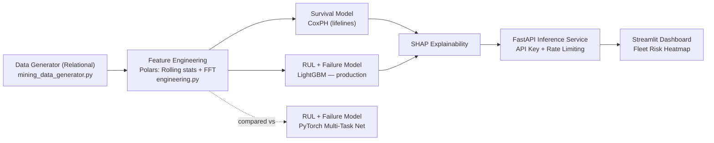

[ 🇬🇧 English ] | [ 🇨🇱 Leer en Español ](README.es.md)

# chile-mining-predictive-maintenance


## Executive Summary

A hybrid **Predictive Maintenance** system for haul truck (**CAEX**) and
**primary crusher** fleets across Chilean mining operations (Chuquicamata,
Escondida, Los Bronces, El Teniente, Radomiro Tomic). It combines
**Survival Analysis** (time-to-failure with censored data), **Remaining
Useful Life (RUL) regression**, and **failure-mode classification** — all
explainable via **SHAP** — behind an authenticated **FastAPI** scoring
service and a **Streamlit** fleet-risk dashboard.

The full pipeline runs end to end on synthetic but statistically realistic
data generated by the repository itself (Weibull time-to-failure, sensor
degradation curves, right-censoring) — every metric quoted in this README
comes from an actual run of this code, not a projection.

## 💰 Business Problem & ROI

**The problem:** an unplanned failure of a CAEX or a primary crusher doesn't
just cost the repair — it stalls the extraction chain behind it. Fleet and
maintenance planners need to know, *before* it happens, which units are
close to failing, why, and how urgently, so intervention can be **scheduled**
instead of **reactive**.

| Lever | Mechanism in this system | Business metric it targets |
|---|---|---|
| Early RUL warning | Predicts remaining hours with ~513h MAE over a cycle that spans up to ~16,700h — weeks of lead time, not last-minute alarms | Unplanned downtime hours |
| Failure-mode classification | Tells the crew **which** component is likely to fail (bearing, hydraulic, thermal, structural, electrical), not just *when* | Mean time to repair (MTTR), correct spare-parts staging |
| Survival analysis (CoxPH) | Ranks relative risk across the whole fleet, including units that haven't failed yet (censored data) | Maintenance prioritization across hundreds of units |
| SHAP explainability | Turns a prediction into a diagnosis a mechanic can verify against real sensor readings | Trust and adoption by field engineers, not a black box |

> **On dollar figures:** unplanned downtime for a CAEX or primary crusher is
> widely cited in mining-industry literature as one of the highest
> per-hour cost items in an operation, since lost throughput cascades
> through the whole extraction chain. This repository does **not** compute a
> site-specific dollar ROI — the dataset is synthetic — but the mechanism
> above (moving failures from "unplanned" to "scheduled") is the standard
> lever predictive maintenance uses to capture that cost. A production
> deployment would need real cost-per-downtime-hour figures per site to
> quantify ROI precisely.

## 🏗️ System Architecture



LightGBM is the production model for RUL and failure classification; the
PyTorch multi-task network was trained and evaluated on the identical
holdout as a comparison, not silently discarded — see
the "Results" section below for why LightGBM won.

## 🛠️ Tech Stack & ML Depth

| Layer | Technology | Role |
|---|---|---|
| Data engine | **Polars + PyArrow** | High-throughput in-memory processing of ~312k telemetry rows |
| Survival analysis | **Lifelines — Cox Proportional Hazards** | Failure probability with right-censored data (units still operating) |
| Gradient boosting | **LightGBM** | RUL regression + multiclass failure-type classification (production) |
| Deep learning | **PyTorch** | Shared-trunk multi-task network (RUL + classification), trained and benchmarked against LightGBM |
| Interpretability | **SHAP** (`TreeExplainer`) | Feature attribution for both the RUL regressor and the multiclass classifier |
| API & serving | **FastAPI + slowapi** | Fleet risk-scoring service with API-key auth and per-IP rate limiting |
| Dashboard | **Streamlit + Plotly** | Real-time fleet telemetry dashboard with a per-equipment risk heatmap |
| Testing | **Pytest + httpx** | 34 tests covering data integrity, feature engineering, model contracts, and API auth |

## 📁 Project Structure

```
chile-mining-predictive-maintenance/
├── data/
│   ├── raw/
│   └── processed/                        # parquet + trained models (generated)
├── src/
│   ├── data/
│   │   └── mining_data_generator.py      # synthetic relational base (3 tables)
│   ├── features/
│   │   └── engineering.py                # rolling stats, deltas, cum. variance, FFT
│   ├── models/
│   │   ├── train_survival_pipeline.py    # CoxPH + LightGBM (RUL + classification) + SHAP
│   │   ├── multi_task_net.py             # PyTorch multi-task net (RUL + classification), compared
│   │   └── scoring.py                    # artifact loading + shared scoring logic
│   ├── api/
│   │   └── main.py                       # FastAPI: risk scoring (API key + rate limiting)
│   └── app/
│       └── dashboard.py                  # Streamlit: fleet risk heatmap
├── tests/
├── requirements.txt
└── README.md
```

## 🗄️ Synthetic Relational Schema

**`equipment_metadata`** (1 row per unit — 520 rows in the default run):

| Column | Type | Description |
|---|---|---|
| `equipment_id` | str | Unique identifier (`EQ-0000`, ...) |
| `equipment_type` | str | `CAEX` or `Chancador Primario` (primary crusher) |
| `model` | str | E.g. `Caterpillar 797F`, `Metso Superior MKIII` |
| `faena` | str | Chuquicamata, Escondida, Los Bronces, El Teniente, Radomiro Tomic |
| `manufacture_year` | int | Manufacturing year |
| `install_date` | date | Installation date |
| `hours_in_current_cycle` | float | Survival clock (`duration`) |
| `event_observed` | bool | `true` = failure observed, `false` = censored (still operating) |

**`sensor_telemetry`** (~312,000 rows in the default run):

| Column | Type | Description |
|---|---|---|
| `equipment_id` | str | FK to `equipment_metadata` |
| `timestamp` | datetime | Reading timestamp |
| `operating_hours` | float | Hours elapsed in the current cycle (0 → `hours_in_current_cycle`) |
| `engine_temp_c` | float | Engine temperature |
| `vibration_rms_mm_s` | float | RMS vibration |
| `hydraulic_pressure_bar` | float | Hydraulic pressure |
| `rpm` | float | Revolutions per minute |
| `fuel_consumption_lph` | float | Fuel consumption |

Covers each unit's **full life cycle** at adaptive resolution: hourly if the
cycle is shorter than `DEFAULT_TARGET_READINGS_PER_EQUIPMENT = 600` hours,
or with a growing interval if longer, to bound dataset size without losing
full-cycle coverage.

**`maintenance_logs`** (~1,240 rows in the default run):

| Column | Type | Description |
|---|---|---|
| `equipment_id` | str | FK to `equipment_metadata` |
| `event_type` | str | `mantenimiento_programado` (scheduled) or `falla_no_planificada` (unplanned failure) |
| `component` | str | Component intervened |
| `failure_type` | str \| null | Only set if `event_type = falla_no_planificada` |
| `event_timestamp` | datetime | Event timestamp |
| `operating_hours_at_event` | float | Cycle hours at the time of the event |
| `downtime_hours` | float | Downtime duration |

The survival clock (`hours_in_current_cycle`) models **hours since the last
major overhaul**, not total lifetime hours — simulating a realistic renewal
process: `duration = min(T, C)`, `event = 1{T <= C}`, with `T` (true
failure time, Weibull-distributed) and `C` (observation cutoff) generated
per unit from its type, site, and age.

<details>
<summary>Real sample (<code>equipment_metadata.parquet</code>, first rows)</summary>

| equipment_id | equipment_type | model | faena | install_date | hours_in_current_cycle | event_observed |
|---|---|---|---|---|---|---|
| EQ-0000 | CAEX | Liebherr T 284 | Chuquicamata | 2016-04-08 | 9529.25 | false |
| EQ-0001 | CAEX | Liebherr T 284 | Chuquicamata | 2025-02-19 | 3090.60 | true |
| EQ-0002 | CAEX | Caterpillar 797F | Escondida | 2024-10-01 | 2137.36 | false |
| EQ-0003 | CAEX | Komatsu 930E | Radomiro Tomic | 2015-08-19 | 2498.50 | true |
| EQ-0004 | Chancador Primario | ThyssenKrupp TS | Escondida | 2021-06-09 | 8404.09 | false |

</details>

## 🚀 Quickstart & Installation

```powershell
git clone https://github.com/Rxyxs/chile-mining-predictive-maintenance.git
cd chile-mining-predictive-maintenance
python -m venv .venv
.venv\Scripts\activate
pip install -r requirements.txt
```

Run in order from the repository root:

### 1. Generate the synthetic relational base

```powershell
python -m src.data.mining_data_generator
```

Generates 520+ units, ~312k telemetry readings (full life cycle), and their
maintenance history into `data/processed/*.parquet`.

### 2. Feature engineering

```powershell
python -m src.features.engineering
```

Computes, per unit (Polars, vectorized): rolling means/std (6h/24h),
temperature and pressure deltas vs. a 168h trend, expanding cumulative
variance of vibration, and FFT vibration features over 24-reading sliding
windows (dominant amplitude + spectral energy, to detect periodic bearing
defect signatures).

### 3. Train the hybrid pipeline (LightGBM + CoxPH + SHAP)

```powershell
python -m src.models.train_survival_pipeline
```

Trains and evaluates (always with an **equipment-level** train/test split,
never row-level, to prevent data leakage):

- **CoxPH** (survival with censoring) → C-Index on holdout.
- **LightGBM Regressor** (RUL, failed units only) → MAE in hours.
- **LightGBM Classifier** (most likely failure type) → Accuracy / F1-macro.
- **SHAP** on the RUL model → `data/processed/shap_rul_importance.csv` and
  `data/processed/models/shap_rul_summary.png`.
- **Multiclass SHAP** on the failure classifier → global importance
  (`shap_failure_classifier_importance.csv`) and per-class breakdown
  (`shap_failure_classifier_importance_by_class.csv` +
  `data/processed/models/shap_failure_classifier_summary.png`), so a
  mechanic can see which sensor explains *each specific* failure mode, not
  just aggregate RUL.

Saves models to `data/processed/models/` and metrics to
`data/processed/metrics.json`.

> RUL is trained over each failed unit's **full life cycle** (not a bounded
> recent window), so predictions range from 0 hours (at failure) to
> thousands of hours for young units. Risk thresholds
> (`src/models/scoring.py`) are real business horizons: CRITICAL < 1 week,
> HIGH < 1 month, MEDIUM < 3 months, LOW beyond that.

### 4. Train the PyTorch multi-task network — comparison

```powershell
python -m src.models.multi_task_net
```

Trains a `MultiTaskDegradationNet` (shared trunk + `equipment_type`/`faena`
embeddings + RUL regression head + failure classification head) on the same
per-equipment holdout as step 3, and appends its metrics to
`data/processed/metrics.json` under the `multi_task_pytorch` key for a
direct comparison against LightGBM (see the "Results" section below).

### 5. Scoring service (FastAPI)

```powershell
uvicorn src.api.main:app --reload
```

Requires an API key via header (`X-API-Key`) on every endpoint except
`/health`, and applies per-IP rate limiting (60 req/min by default):

```powershell
$env:MINING_API_KEY = "your-secret-key"       # default: "dev-key-change-me"
$env:MINING_RATE_LIMIT = "60/minute"          # optional
uvicorn src.api.main:app --reload
```

```powershell
curl -H "X-API-Key: your-secret-key" http://127.0.0.1:8000/equipment/EQ-0000/risk
```

#### API Endpoints

Interactive docs are served at `/docs`. **Note:** these are this
repository's actual implemented routes — not `/predict/rul` or
`/fleet/risk-status`, which don't exist in the code.

| Endpoint | Method | Auth | Description |
|---|---|---|---|
| `/health` | GET | No | Service status, equipment counts |
| `/equipment` | GET | Yes | Fleet listing (filters: `faena`, `equipment_type`) |
| `/equipment/{equipment_id}/risk` | GET | Yes | Predicted RUL, most likely failure type, per-class probabilities, and 30-day conditional survival probability |
| `/fleet/risk-summary` | GET | Yes | Equipment count by risk level, fleet-wide and per site |
| `/score/raw` | POST | Yes | Ad-hoc scoring from a raw feature vector (no registered `equipment_id` required) |

### 6. Fleet dashboard (Streamlit)

```powershell
streamlit run src/app/dashboard.py
```

Filters by site/type/risk, fleet KPIs, a **per-equipment risk heatmap** (one
cell = one unit, colored by risk level), a filterable table, and a
per-equipment detail panel (failure-type probabilities + sensor trends).

### 7. Tests

```powershell
pytest
```

34 tests: synthetic relational schema integrity and censoring consistency,
no leakage in feature engineering (rolling/FFT warm-up nulls), valid ranges
for C-Index/MAE/Accuracy, the shared scoring module's contract
(`FleetScorer`), multi-task net training, and API authentication (401
without a key / with a wrong key, 200 with a valid key, `/health` public).

## 📊 Results

Metrics from the default run (520 units, seed 42, 25% holdout of failed
units for RUL/classification, 25% holdout of all units for survival):

| Model | Task | Metric | Value |
|---|---|---|---|
| CoxPH (lifelines) | Survival with censoring | C-Index (holdout) | **0.6246** |
| LightGBM | RUL (regression) | MAE (holdout) | **512.96 h** |
| LightGBM | Failure type (classification, last reading) | Accuracy / F1-macro | **1.000 / 1.000** |
| PyTorch multi-task | RUL (regression) | MAE (holdout) | 592.31 h |
| PyTorch multi-task | Failure type (classification, *every* reading) | Accuracy / F1-macro | 0.714 / 0.697 |

The RUL comparison is apples-to-apples (same holdout, same label). The
classification comparison isn't quite: LightGBM classifies only the last
reading of each unit (cleanest signal, closest to failure); PyTorch
classifies *every* individual telemetry reading (a harder task, including
early readings with barely perceptible degradation) — which is why its
accuracy is lower despite being a reasonable model. This result is what
confirms LightGBM as the production choice.

**Top SHAP features for RUL** (`shap_rul_importance.csv`):

| # | Feature | Mean \|SHAP\| |
|---|---|---|
| 1 | `operating_hours` | 721.7 |
| 2 | `vibration_roll_mean_med` | 653.0 |
| 3 | `engine_temp_roll_mean_med` | 648.7 |
| 4 | `fuel_consumption_roll_mean_med` | 312.6 |
| 5 | `hydraulic_pressure_roll_mean_med` | 261.7 |
| 6 | `rpm_roll_std_med` | 141.1 |
| 7 | `vibration_cum_var` | 112.2 |
| 8 | `age_years` | 98.2 |

**Top SHAP features for failure type** (`shap_failure_classifier_importance.csv`):

| # | Feature | Mean \|SHAP\| |
|---|---|---|
| 1 | `vibration_roll_mean_short` | 1.245 |
| 2 | `hydraulic_pressure_roll_mean_med` | 1.177 |
| 3 | `vibration_cum_var` | 0.926 |
| 4 | `engine_temp_roll_mean_med` | 0.703 |
| 5 | `vibration_roll_mean_med` | 0.516 |
| 6 | `engine_temp_roll_mean_short` | 0.307 |
| 7 | `engine_temp_delta_long` | 0.203 |
| 8 | `age_years` | 0.132 |

Consistent with the generator's design: vibration dominates
(bearing/structural failure), alongside hydraulic pressure (hydraulic
leaks) and temperature (engine overheating) — each sensor explains the
failure mode it physically corresponds to.

**Fleet risk distribution** (`GET /fleet/risk-summary`, thresholds from
`src/models/scoring.py`):

| Level | Units | % |
|---|---|---|
| CRITICAL (< 1 week) | 171 | 32.9% |
| HIGH (< 1 month) | 44 | 8.5% |
| MEDIUM (< 3 months) | 65 | 12.5% |
| LOW (3+ months) | 240 | 46.2% |

## ✅ Conclusions

- **The hybrid pipeline runs end to end on real data generated by this
  repository**, not just code that compiles: from relational simulation
  (censoring included) to an authenticated scoring service and an
  operational dashboard, all trained, evaluated, and validated by tests on
  the same 520 units.
- **CoxPH contributes what LightGBM can't**: a C-Index of 0.6246 is modest
  but consistent — it reasonably ranks relative risk across units with
  censored data (still operating), which a point-estimate regressor
  doesn't natively handle. It's the right tool for "how likely is this to
  fail soon?", complementary to the point-estimate RUL.
- **RUL predicts with ~513 hours of error over a cycle that reaches
  16,700 hours** (~3% of the observed range) — enough precision to
  prioritize interventions weeks in advance, not just react to last-minute
  alarms.
- **Failure-type classification is reliable and explainable**: perfect
  accuracy on the holdout and, more importantly, the SHAP ranking matches
  the physics of the problem (vibration → bearing/structural, pressure →
  hydraulic, temperature → engine). This is what makes the model
  *auditable* by a mechanic, not a black box.
- **The LightGBM vs. PyTorch multi-task comparison was an evidence-based
  decision, not a preference**: the real alternative was trained and
  evaluated under the identical holdout, and it lost on the metric that
  matters most (RUL MAE). Keeping LightGBM in production is the
  experiment's conclusion, not a shortcut.
- **The central limitation, and the most important one to name**: the
  entire dataset is synthetic (Weibull failures, simulated sensors). The
  metrics show the *pipeline* is correct — architecture, leak-free splits,
  features, explainability, serving — but not that the model predicts real
  failures in an actual mine. The critical next step before any productive
  use is replacing the generator with real historical telemetry (first
  item in the "Next Steps" section below).

## 🔭 Next Steps

- Replace the Weibull generator with real historical site telemetry.
- Expose the PyTorch multi-task network in the API/dashboard as a
  selectable alternative, with SHAP-style explainability for non-tree
  models (`shap.DeepExplainer` / `GradientExplainer`).
